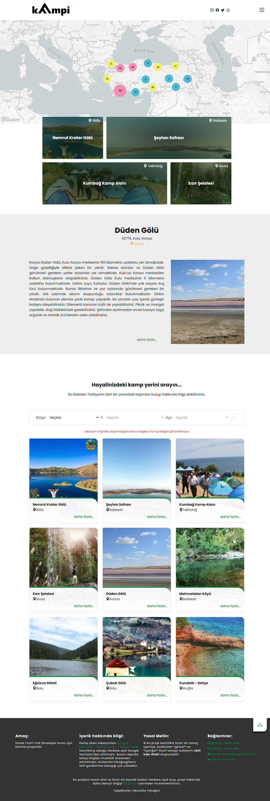
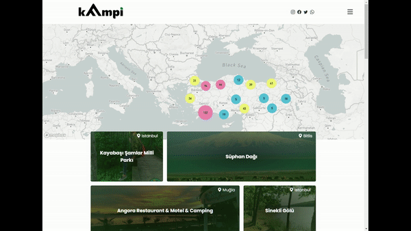
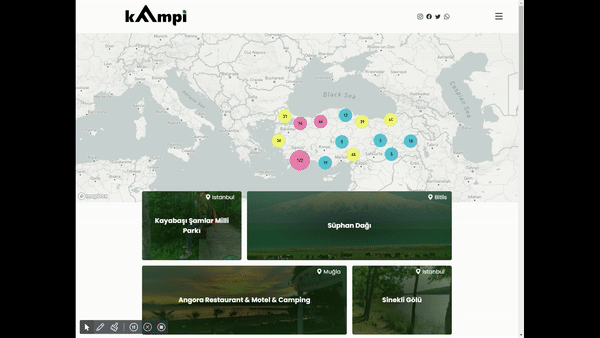
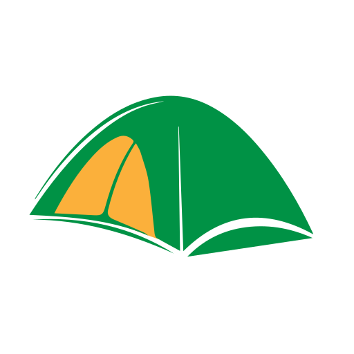
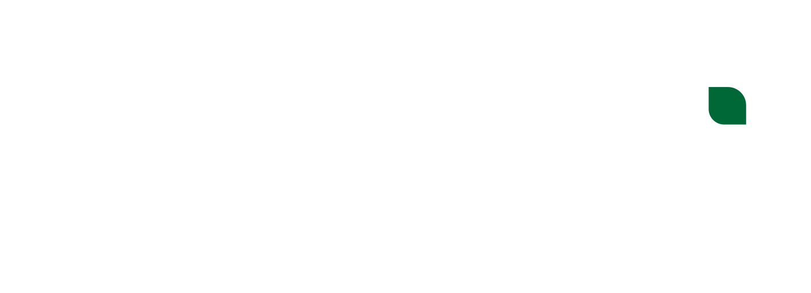

# Kampi Web Uygulaması Front-End

[Kampyerim Okubeni](../readme.md) > [Back-End Okubemi](../kampsitesi-nack-end/readme.md) | Front-End Okubeni

Bu Front-End projesi İsmek Front-End Developer kursu için bitirme projesi olarak hazırlanmıştır.

## İndeks

- [Site Hakkında](#sitehakkinda)
  - [Sitenin Görünümü](#sitenin-görünümü)
  - [Menü Tasarımı](#menü-tasarımı)
  - [Kart Filtreleme](#filtreleme)
- [Kullanılan Paketler](#kullanılan-paketler)
  - [@babel](#babel)
  - [Live Sass Compiler](#live-sass-compiler)
  - [mapbox](#mapbox)
- [Kullanılan Programlar](#kullanılan-programlar)
  - [Visual Studio Code Insiders](#visual-studio-code-insiders)
  - [node.js](#nodejs)
  - [Google Chrome](#google-chrome)
  - [Google Chrome Geliştici Araçları](#google-chrome-geliştirici-araçları)
  - [Postman](#postman)
  - [RapidAPI](#rapidapi)
  - [Adobé Illustrator](#adobé-illustrator)
  - [Adobé Photoshop](#adobé-photoshop)

## Site Hakkında

Sitenin amacı Türkiye'de bulunan kamp yerlerini listeleyip. Seçilen kamp yerinin bize olan uzaklığını, o anki ve ileri tarihteki 3 günlük hava durumunu görüntülemek üzere tasarlanmış bir web sitesi. Geliştirmeye oldukça açık olduğunu düşünüyorum. Daha sonra eklenecek bir admin paneli ile güncelme yapmak. Hatta kullanıcı yorumları eklemek de mümkün olabilir.

Kamp sayfasını ayrı olarak düşündüğümden, ziyaretçi gitmek istediği kampı tarayıcısına pileyip, daha sonra hava durumu bilgisini takip edbilir. Geliştirme açısından da uygun API bulunursa yol durumu da eklenebilir. Bu sayede gitmeyi düşündüğü yeri daha kolay takip edebilir ve bu yer hakkında bilgi edinebilir. Youtube API eklenip bu yer ile ilgili videolar aranıp ilgili videolar sitede gmrüntülenebilir.

## Sitenin Görünümü

Sitenin tasarımı aslında kodlarken çok değişti. İki kez logosunu değiştirdiğim için, tasarımını da az biraz değiştirmek gerekti. Son tasarımda kart ve uygulama elemanlarının kenarlarını logo ile uyum sağlamak üzere kavisli hale getirdim.

### Menü tasarımı

Menü'yü en başa eklemektense sürekli sayfada duracak bir hamburger menü olarak tasarladım. Sayfa başındaki menüde çok fazla eleman olması gerekmediğinden. Sayfa başındaki menüyü sürekli ekranda tutma gereği hissetmedim.

### Filtreleme

Daha önce yatığım front-end filtrelemesi yerine filtreleme işini back-end'e bıraktım. Şu an sayfadaki kriterlerden ziyade, headerlara eklenecek herhangi bir filtrelemeye yanıt verecek şekilde tasarladım. Fakat bu işlevi back-end'de iptal ettim. Amacım bütün veri tabanına bir şekilde sayfa dışından ulaşılmasını engellemek. Back-end hiçbir koşulda bütün veri tabanını front-end'de göndermeyecek şekilde tasarlandı. Lâkin bütün koşulları test edemediğimden açık kalmış olabilir. Back-End yazımına fazla zaman ayırmak istemedim. Bu yüzden bu kısım çok da geçerli olmayabilir. Kod gözden geçirme ile çözülebilir.

## Kullanılan Paketler

- [x] [@babel](https://www.npmjs.com/package/@babel/core)
- [x] [live-sass-compiler](https://marketplace.visualstudio.com/items?itemName=glenn2223.live-sass)
- [x] [mapbox](https://www.mapbox.com/)

### @babel

Babel ES5 üzeri yazdığım javascript dosyasını ES5'e çeviren npm paketi.

### Live Sass Compiler

Özellikle bu paketi yülememin sebebi (Glenn Marks) eski versioyon `@node/sass` kullanıyor. Bu ise `@dart/sass` kullandığı için hem yeni sass kütüphanelerini hem de @import yerine `@use` ve `@forward` destekliyor.

### mapbox

Mapbox Açık harita paketi. Cluster özelliğini sevmen açısından ve sayfa içinde uygulanabilirliği çok kolay olduğundan tercih ettim. Ayrıca back-end'de zip kodları ve lokasyon bilgilerini veritabanı seedlemen için de reversegeolocation, mesafe ölçümü için de karayolu uzaklığı hizmetinden yararlandım.

## Kullanılan Programlar

### Visual Studio Code Insiders

Front-End ve Back-End bu yazılım ile kodlandı.

[vscode-insiders link](https://code.visualstudio.com/insiders/)

### Node.JS

Back-End node üzerinde express server ile çalışmakta. Aynı zamanda Front-Edn için babel node.js kullanarak javascript'i çevirmekte.

[node.js link](https://nodejs.org/en/)

### Google Chrome

#### Google Chrome Geliştirici Araçları

[Google Chrome link](https://www.google.com/intl/tr_tr/chrome/)

### Postman

Back-End ve API testleri için kullandım.

[postman link](https://www.postman.com/)

### Rapidapi

Accu-weather üyeliği için kullandım Programdan çok hizmet aslında ama yazmak istedim. [rapidapi link](https://rapidapi.com)

### Adobé Illustrator

Logo tasarımı için kullandım.

[Adobée Illustrator link](https://www.adobe.com/tr/products/illustrator.html)

logo erkek (pozitif)

> 

logotype erkek (pozitif)

> 

logo dişi (negatif)

> 

logotype dişi (negatif)

> 

### Adobé Photoshop

Dummy görsel ve önyükleyici animasyonu için kullandım.

[Adobée Photoshop link](https://www.adobe.com/tr/products/photoshop.html)

preloader

> 

## Teşekkürler

Mustafa Yatağan

[mustafayatagan@gmail.com](mailto:mustafayatagan@gmail.com)
